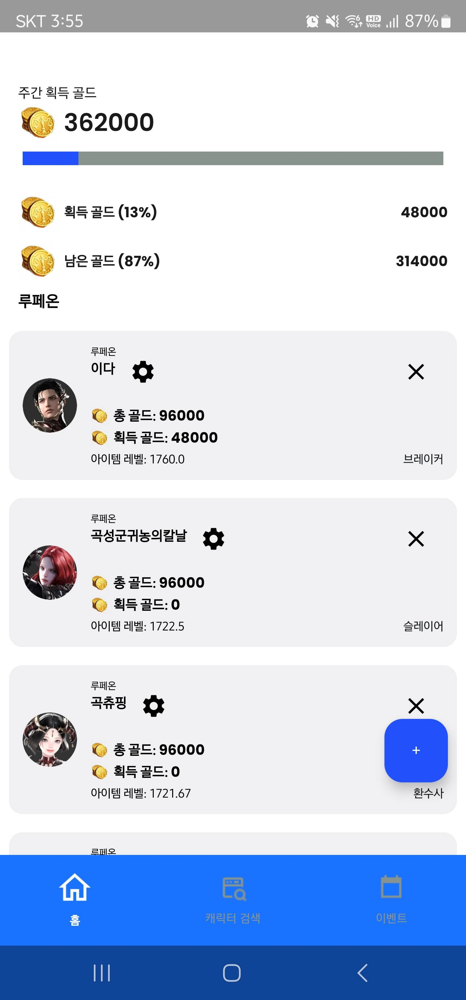
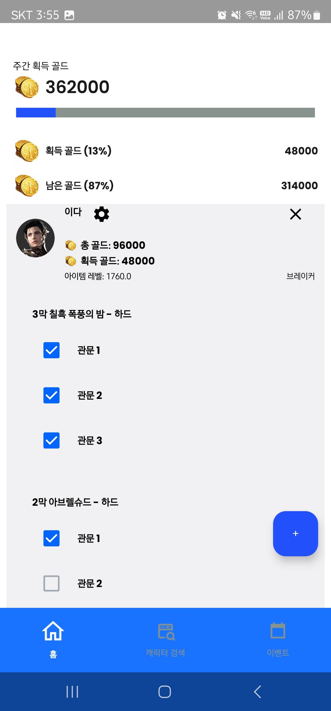

# 마이로아 (MyROA) - Lost Ark 캐릭터 관리 앱


> **마이로아**는 Lost Ark 유저를 위한 캐릭터 및 주간 레이드 관리 앱입니다.  
> 캐릭터를 검색하고, 골드 수익과 진행 상태를 직관적으로 관리할 수 있습니다.

---

## 🧩 주요 기능

### 🔍 캐릭터 검색
- **로스트아크 Open API**를 통해 캐릭터 이름으로 실시간 검색
- 캐릭터의 서버, 클래스, 평균 아이템 레벨 정보를 자동으로 불러오기
- 검색된 캐릭터를 앱에 저장하여 관리 가능

### 🎯 캐릭터 관리
- 저장된 캐릭터 목록 확인 및 삭제
- 캐릭터별 주간 진행 현황 확인 가능

### ⚔️ 주간 레이드 추적
- 캐릭터당 최대 3개의 레이드 선택 가능
- 레이드 클리어 여부 체크
- 예상 골드 수익 및 현재 진행률 시각화 제공

### 🏝️ 모험 섬 실시간 정보
- 현재 시간 기준으로 등장 중인 모험 섬 표시
- 다음 등장 시간까지 남은 시간 실시간으로 업데이트

---
## 📱 앱 화면 미리보기

---

### 🏠 홈 화면 및 주요 기능
| 홈 화면 | 레이드 선택 | 캐릭터 추가 |
|:--:|:--:|:--:|
|  |  |  |

---

### 🧙 캐릭터 검색 및 상세 정보
| 캐릭터 검색 | 장비 | 각인 |
|:--:|:--:|:--:|
|  |  |  |

| 스킬 | 아바타 | 보유 캐릭터 | 수집형 |
|:--:|:--:|:--:|:--:|
|  |  |  |  |

---

### 📰 이벤트 화면
<p align="center">
  
</p>

---

## 🛠️ 기술 스택

| 기술 | 설명 |
|------|------|
| **Kotlin** | Android 개발 언어 |
| **Jetpack Compose** | 최신 UI Toolkit 사용 |
| **Room** | 로컬 데이터 저장 (캐릭터/레이드 정보) |
| **Ktor** | Lost Ark Open API 연동 |
| **Koin** | 의존성 주입 (DI) |
| **ViewModel + State** | MVVM 기반 UI 상태 관리, 단방향 데이터 흐름 적용 |

---

## 📁 모듈 구조

- 기능별 멀티 모듈 구조를 통해 **유지보수성과 테스트 용이성**을 높였습니다.
```Lostark/
├── app/                       # 앱 실행을 담당하는 메인 모듈 (UI Entry Point)
│
├── character/                # 캐릭터 검색 및 관리 기능 모듈
│   ├── data/                 # API, DB 관련 구현
│   ├── domain/               # UseCase, Entity 등 비즈니스 로직
│   └── presentation/         # Compose UI 및 ViewModel
│
├── events/                   # 게임 이벤트 및 모험섬 정보 표시 모듈
│   ├── data/                 # 이벤트 API 호출 등 데이터 계층
│   ├── domain/               # 이벤트 도메인 로직
│   └── presentation/         # 이벤트 UI 구성 및 상태 관리
│
├── core/                     # 공통 코드 모듈 (앱 전역에서 사용)
│   ├── model/                # 공통 데이터 모델 정의
│   ├── data/                 # 공통 데이터 처리 유틸 (e.g., Result wrapper)
│   └── domain/               # 공통 비즈니스 로직 (e.g., Error 처리)
│
├── build-logic/              # Gradle Convention Plugins 관리
│   └── convention/           # Android/Kotlin 설정 공통화 (build.gradle.kts)
│
└── docs/                     # 프로젝트 문서 및 스크린샷 이미지
    └── screenshots/
```
---

## 🧑‍💻 개발자

| 이름 | GitHub |
|------|--------|
| 한정우 (HJW0623) | [@hjw0623](https://github.com/hjw0623) |


